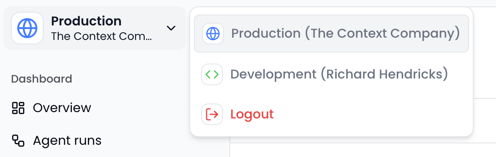

## Production (cloud-hosted)

The cloud production environment is intended for production use. It is a fully-featured environment that allows you to monitor and observe your production applications. Features include:
- **Detailed traces**: Deeply understand every agent run's execution flow, reasoning, steps, and tool calls.
- **Search, filter, sort**: Search across all of your agent runs, steps, and tool calls, filter by custom metadata, and sort by any field.
- **Score and text feedback**: Collect score (thumbs up & thumbs down) and text feedback (up to 2000 characters) from end users.
- **Agent sessions**: Group related agent runs into agent sessions, such as "conversations" between a human user and an AI agent.
- **Aggregate observability**: Large-scale metrics on all of your agent runs, including latency, costs, scores, tool calls, and more.

## Development (cloud-hosted)

Every user gets their own private, cloud-hosted development environment. This is great for staging and debugging purposes during development.

To use dev mode, simply set the `TCC_API_KEY` environment variable to your user-level API key that begins with `dev_` and switch to the development environment in the [dashboard](https://www.thecontext.company/dev/runs).

## Local mode for Next.js + AI SDK

[Local mode](/frameworks/ai-sdk/local) is a local-first development environment that lets you run The Context Company locally within your Next.js app.